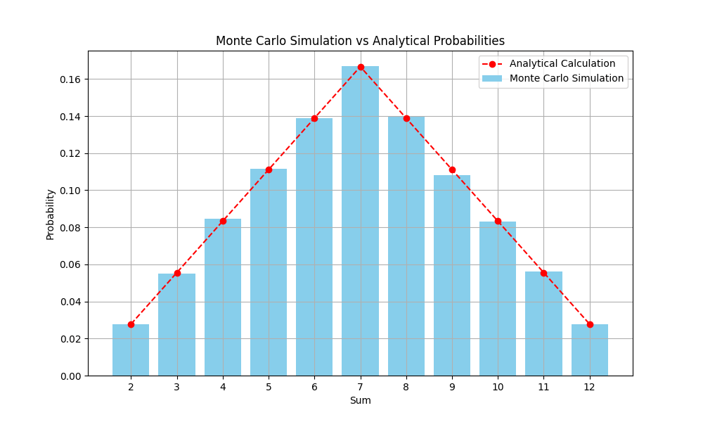

# goit-algo-fp

Final project. Basic Algorithms and Data Structures at GoIT Neoversity

# Monte Carlo Simulation for Dice Rolls

## Introduction

Task 7 of the project implements a Monte Carlo simulation to estimate the probabilities of sums obtained from rolling two six-sided dice. The simulation results are compared with the analytical probabilities derived from theoretical calculations.

## Methodology

- **Monte Carlo Simulation**: 
  - The simulation was run for 100,000 iterations. In each iteration, two six-sided dice were rolled, and the sum of the two dice was recorded.
  - The number of occurrences for each possible sum (from 2 to 12) was counted, and the probability for each sum was calculated by dividing the count by the total number of rolls.

- **Analytical Probabilities**:
  - The theoretical probabilities for each sum were calculated based on the possible combinations of dice rolls that can result in each sum. For example, there is only one combination to get a sum of 2 (rolling two 1s), so the probability is 1/36. The sum of 7 has the highest probability because it can be obtained in six different ways.

## Results

### Monte Carlo Simulation Probabilities

| Sum  | Probability |
|------|-------------|
| 2    | 2.77%       |
| 3    | 5.49%       |
| 4    | 8.48%       |
| 5    | 11.16%      |
| 6    | 13.91%      |
| 7    | 16.70%      |
| 8    | 13.98%      |
| 9    | 10.83%      |
| 10   | 8.30%       |
| 11   | 5.63%       |
| 12   | 2.76%       |

### Analytical Probabilities

| Sum  | Probability (Fraction) | Probability (%) |
|------|------------------------|-----------------|
| 2    | 1/36                   | 2.78%           |
| 3    | 2/36                   | 5.56%           |
| 4    | 3/36                   | 8.33%           |
| 5    | 4/36                   | 11.11%          |
| 6    | 5/36                   | 13.89%          |
| 7    | 6/36                   | 16.67%          |
| 8    | 5/36                   | 13.89%          |
| 9    | 4/36                   | 11.11%          |
| 10   | 3/36                   | 8.33%           |
| 11   | 2/36                   | 5.56%           |
| 12   | 1/36                   | 2.78%           |

## Visualization

The comparison between the Monte Carlo simulation results and the analytical probabilities is visualized in the chart below. The bar graph represents the simulated probabilities, while the red dotted line shows the analytical probabilities.

## Conclusion

- The Monte Carlo simulation closely matches the analytical probabilities, with only minor deviations. These differences are expected due to the randomness inherent in the simulation process.
- The sum of 7 is the most likely outcome, as predicted by both the simulation and theoretical calculations, occurring approximately 16.7% of the time.
- The visual comparison in `task_7_results.png` further confirms that the Monte Carlo simulation is a valid method for estimating the probabilities of different outcomes when rolling two dice.

This task demonstrates the effectiveness of the Monte Carlo method for estimating probabilities and highlights the reliability of theoretical calculations when dealing with simple probabilistic events like dice rolls.

## Test Environment
The results were obtained on a MacBook Pro 2021 with an Apple M1 Pro processor.